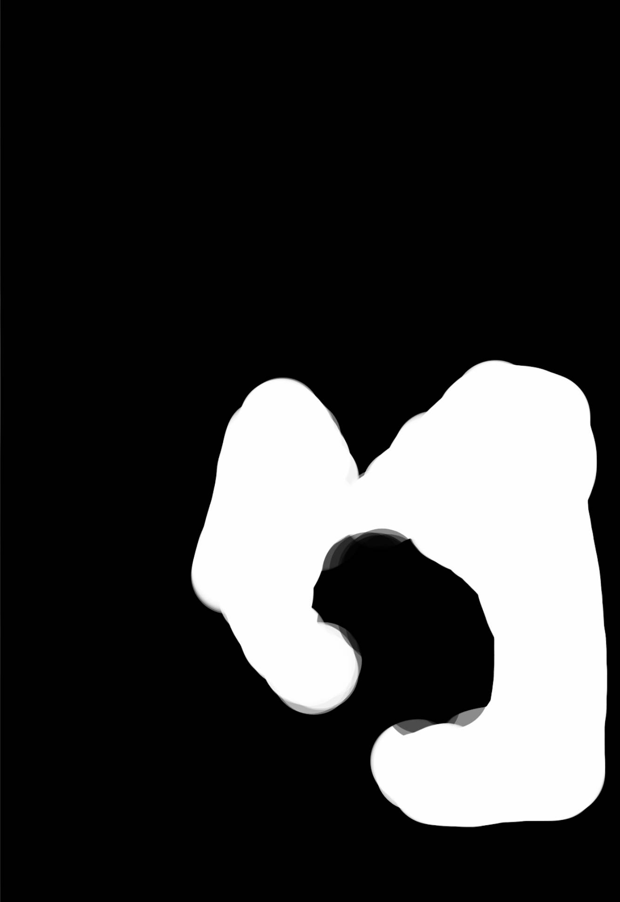
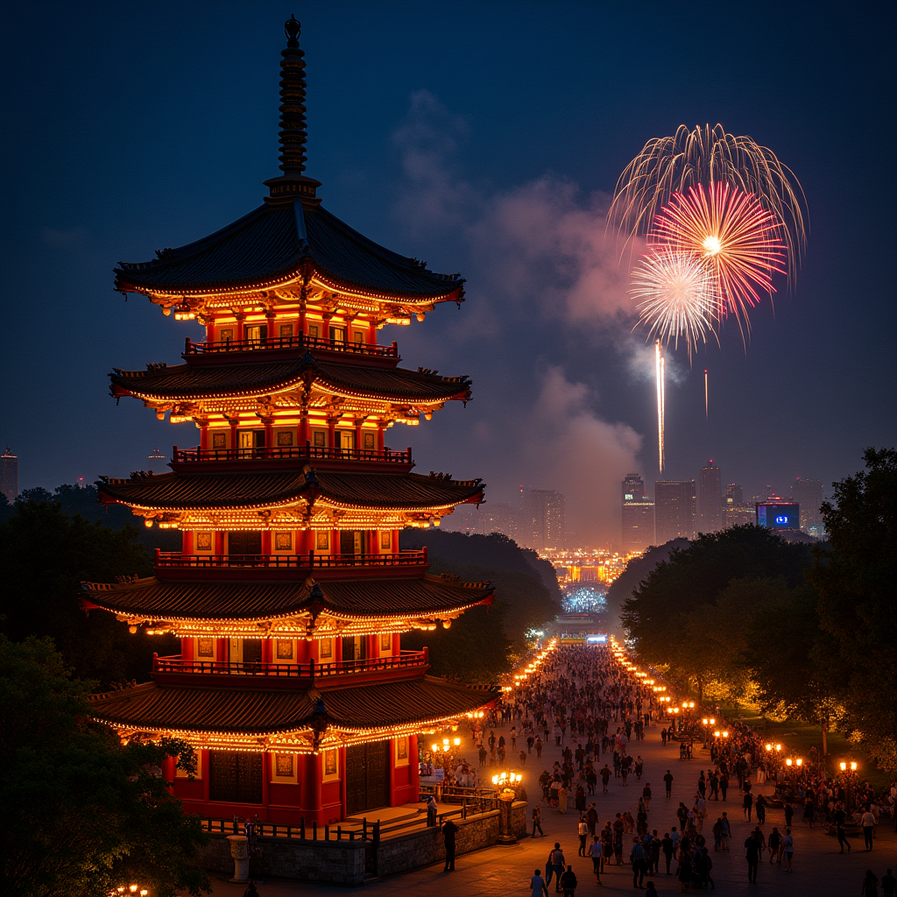
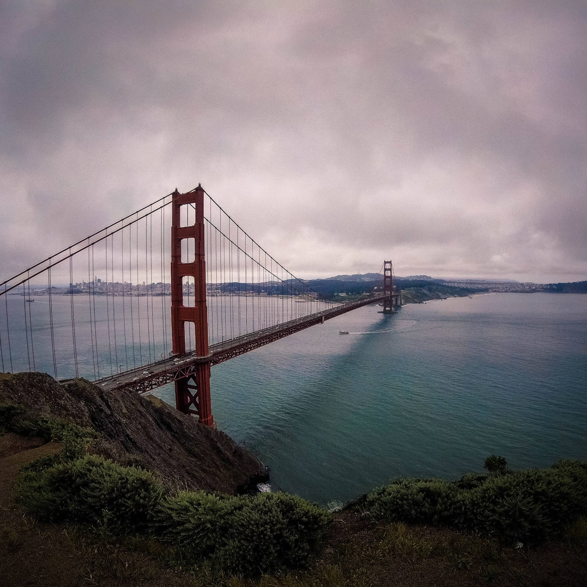
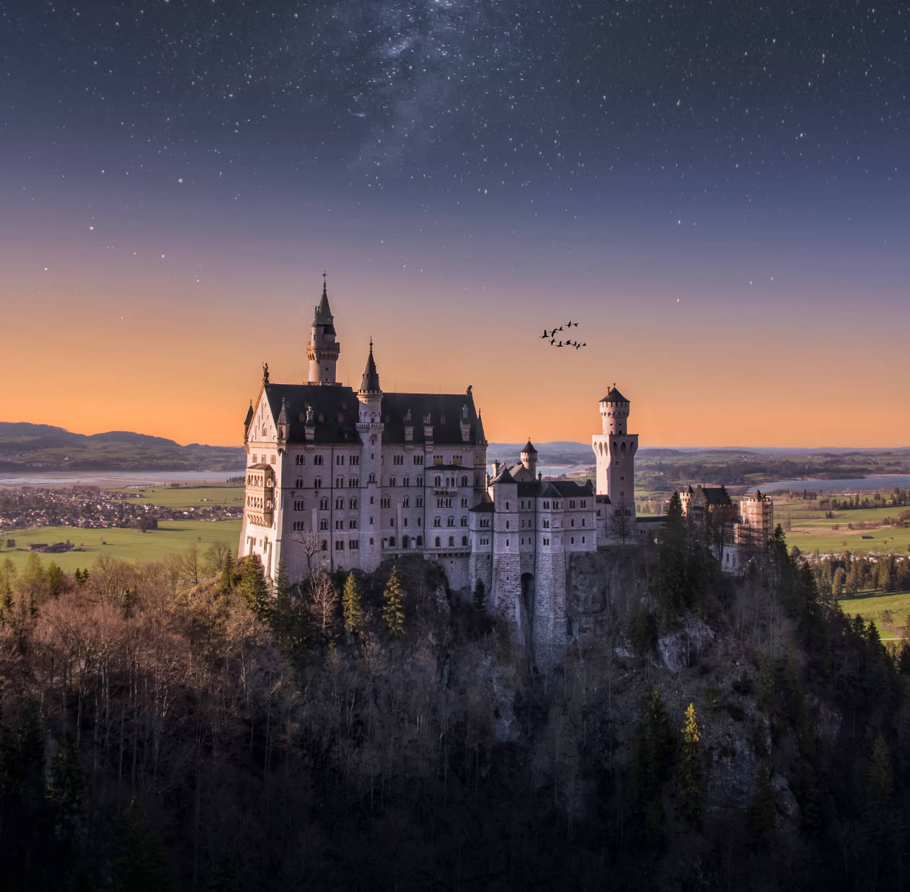
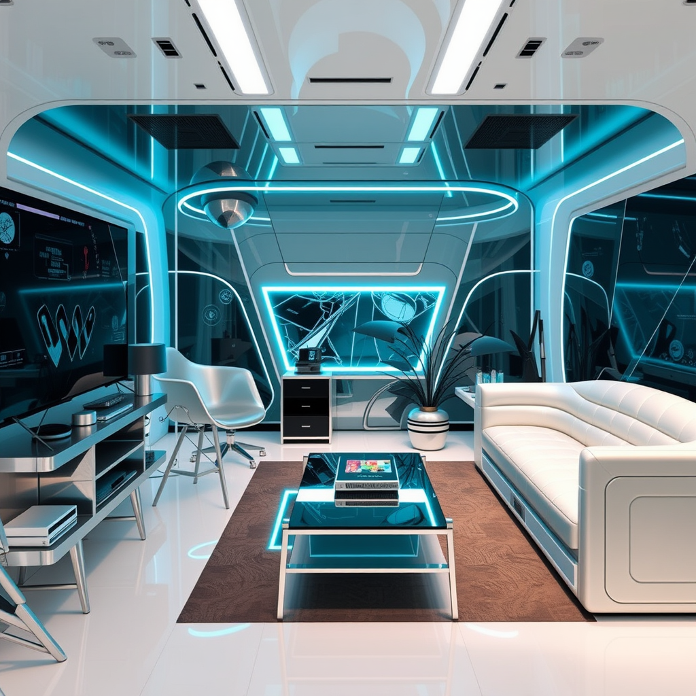
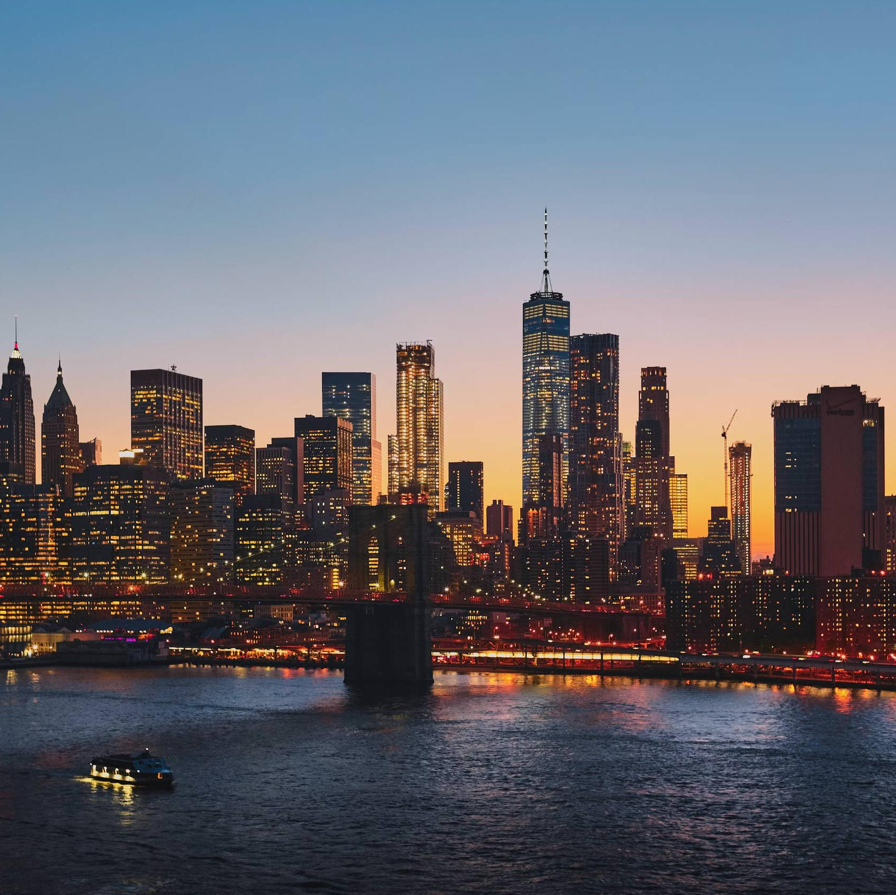

---

# 1
## Instruction
### Generate a 2048*2048 ultra-high resolution image of an astronaut riding a majestic horse through outer space
## Ours

## GPT-4o

---

# 2
## Instruction
### Generate a 2048*2048 ultra-high resolution image of a breathtaking natural landscape featuring majestic mountains, crystal-clear lakes, and radiant sunlight
## Ours

## GPT-4o

---

# 3
## Instruction
### Generate a 2048*2048 ultra-high resolution image faithfully recreating an epic ancient civilization scene with grand temples, elaborate stone carvings, and large-scale architecture
## Ours

## GPT-4o

---

# 4
## Instruction
### Based on the given reference image `style_disco.jpg`, generate an image describing a medieval fantasy tale, depicting a knight in fierce battle with a dragon
## Reference

## Ours

## GPT-4o

---

# 5
## Instruction
### Based on the given reference image `style_v3.jpg`, generate an image describing A little girl is rowing a boat in a downtown park, with a dog on board. In the foreground, willow trees surround the park. In the middle ground, a Ferris wheel and a carousel from the amusement park are visible. In the background, skyscrapers can be seen.
## Reference

## Ours

## GPT-4o

---

# 6
## Instruction
### Based on the given masked reference image `cowboy_mask.png`, generate an image: A cowgirl is riding a horse along the railroad tracks
## Reference

## Ours

## GPT-4o

---

# 7
## Instruction
### Based on the given masked reference image `tower_mask.png`, generate an image: A tower glowing with lanterns during a traditional night festival, with fireworks lighting up the distant sky and ancient trees surrounding the festive square.
## Reference

## Ours

## GPT-4o

---

# 8
## Instruction
### Based on the given two reference images `xiaomi.jpg` and `road.jpg`, generate a merged image
## Reference

## Ours

## GPT-4o

---

# 9
## Instruction
### Based on the given two reference images `pyramid.jpg` and `EiffelTower.jpg`, generate a merged image
## Reference

## Ours

## GPT-4o

---

# 10
## Instruction
### Based on the given reference images `dinner.jpg`, remove the knife and fork in the image
## Reference

## Ours

## GPT-4o

---

# 11
## Instruction
### Based on the given reference images `bridge.jpg`, remove the bridge in the image
## Reference

## Ours

## GPT-4o

---

# 12
## Instruction
### Based on the given reference images `windmill.jpg`, remove the windmill in the image
## Reference

## Ours

## GPT-4o

---

# 13
## Instruction
### Based on the given reference images `bridge.jpg`, replace the bridge in the image with Chineses traditional stone arch bridge
## Reference

## Ours

## GPT-4o

---

# 14
## Instruction
### Based on the given reference images `train.jpg`, replace the train in the image with High-speed train
## Reference

## Ours

## GPT-4o

---

# 15
## Instruction
### Based on the given reference images `castle.jpg`, replace the castle in the image with Chineses traditional temple
## Reference

## Ours

## GPT-4o

---

# 16
## Instruction
### Based on the given reference images `castle_2.jpg`, replace the castle in the image with Chineses traditional temple
## Reference

## Ours

## GPT-4o

---

# 17
## Instruction
### Based on the given reference images `room.jpg`, repaint the image according to the depth map of the reference image and the given prompt: A futuristic room
## Reference

## Ours

## GPT-4o

---

# 18
## Instruction
### Based on the given reference images `street.jpg`, repaint the image according to the depth map of the reference image and the given prompt: A Medieval fantasy city
## Reference

## Ours

## GPT-4o

---

# 19
## Instruction
### Based on the given reference images `portrait_1.jpg` and `face_reference_1.jpg`, swap the faces of the two images
## Reference

## Ours

## GPT-4o
违反了政策无法生成

---

# 20
## Instruction
### Based on the given reference images `portrait_2.jpg` and `face_reference_2.jpg`, swap the faces of the two images
## Reference

## Ours

## GPT-4o
违反了政策无法生成

---

# 21
## Instruction
### Based on the given reference images `new_york.jpg`, outpaint the image in left and right sides with both 512 pixels, and the prompt is: A spectacular view of New York City's skyline at dusk
## Reference

## Ours

## GPT-4o

---

# 22
## Instruction
### Based on the given reference images `deer.jpg`, outpaint the image in four directions with all 512 pixels, and the prompt is: Standing on the green grass, the deer's body is bathed in a golden glow from the setting sun.
## Reference

## Ours

## GPT-4o

---

# 23
## Instruction
### You are given an image `icecream_2.jpg`. Please according to the reference image, generate a coffee with ice cream version of the ice cream.
## Reference

## Ours

## GPT-4o

---

# 26
## Instruction
### You are given an image `pigeon_scribble.png`. Please according to the reference image, generate a ceramic texture cup with the reference image as the logo. The background is a office table.
## Reference

## Ours

## GPT-4o

---

# 27
## Instruction
### You are given an image `man_1.jpg`, which is a photo of a young man. Generate another photo to show the man as an elderly version of himself, with wrinkles, gray hair, and other signs of aging, while preserving his identity. The result should be a realistic image of an older man.
## Reference

## Ours

## GPT-4o

---

# 29
## Instruction
### Generate an image of a golden text of "Have a nice day!" overlaid on a black background. The result should be an image with the text overlaid.
## Ours

## GPT-4o

---

# 30
## Instruction
### Generate an image of a `cherries.jpg`, convert the image into a version of advertisement, It is placed on the exhibition stand with advanced lighting and color matching.
## Reference

## Ours

## GPT-4o

---

# 31
## Instruction
### Generate an image of a beautiful school in the style of Ghibli Studio.
## Ours

## GPT-4o

---

# 33
## Instruction
### Edit the image of a whole cake `cake.jpg` to make it look like a triangular corner piece has been cut out. The remaining cake should appear untouched and natural
## Reference

## Ours

## GPT-4o

---

# 34
## Instruction
### You are given an portrait image with wrong generated hands`abnormal_hands.png`. Please refine the hands to make them look more natural.
## Reference

## Ours

## GPT-4o

---

# 36
## Instruction
### You are given an image `bareheaded_man.png`. Please generate a new hairstyle for this man and keep the other elements unchanged.
## Reference

## Ours

## GPT-4o

